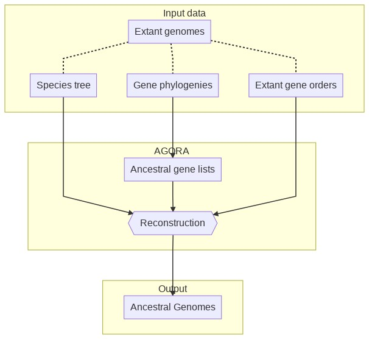
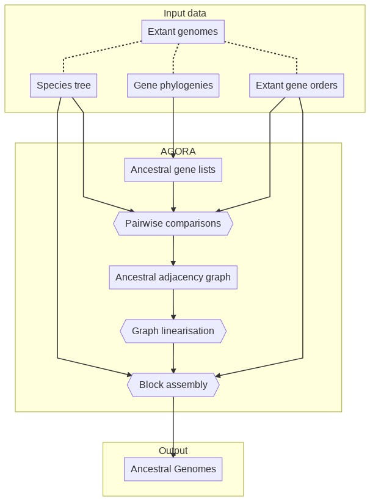
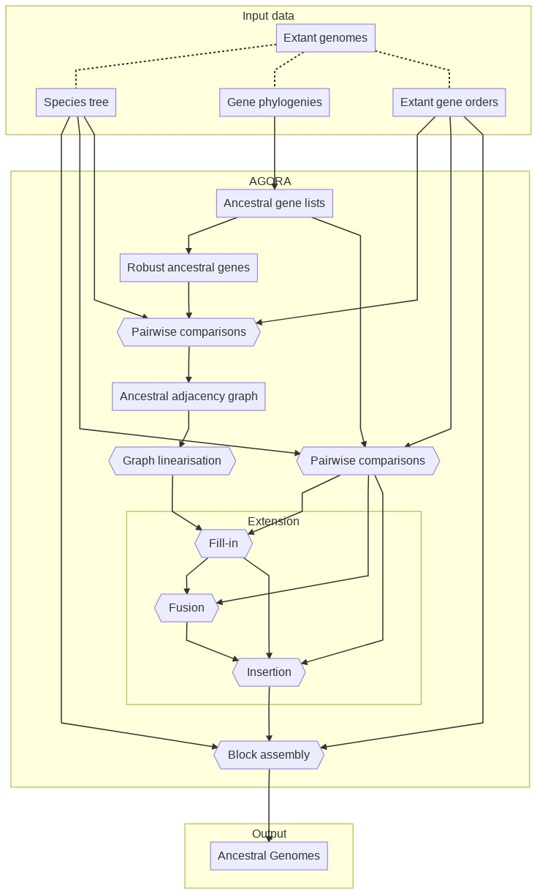
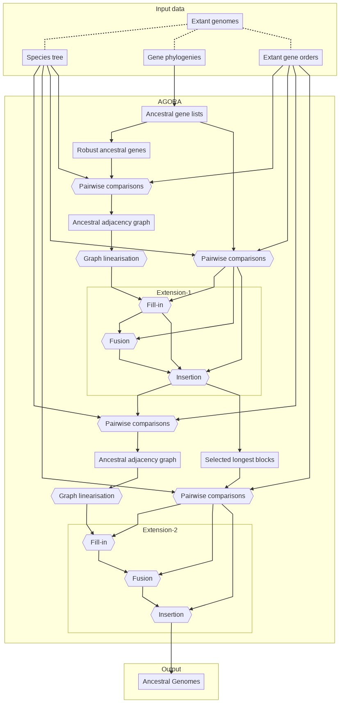

# AGORA How-To

Written by Alexandra LOUIS (alouis {at} biologie {dot} ens {dot} fr),
Matthieu MUFFATO (muffato {at} ebi {dot} ac {dot} uk), and
Hugues ROEST CROLLIUS (hrc {at} ens {dot} fr).
DYOGEN Laboratory, Institut de Biologie de l'École Normale Supérieure
(IBENS)
46 rue d'Ulm, 75005 Paris

**Table of contents:**

* [Introduction](#introduction)
  * [History](#history)
  * [What AGORA does and does not do](#what-agora-does-and-does-not-do)
* [Input file formats](#input-file-formats)
* [Running AGORA](#running-agora)
  * [AGORA with no selection of constrained families](#agora-with-no-selection-of-constrained-families)
  * [AGORA with selection of constrained families](#agora-with-selection-of-constrained-families)
  * [Advanced AGORA usage](#advanced-agora-usage)
* [Output file formats](#output-file-formats)

----

## Introduction

### History

AGORA stands for "Algorithm for Gene Order Reconstruction in Ancestors"
and was initiated by Matthieu Muffato during his PhD (2007-2010) in the
DYOGEN Laboratory at the École normale supérieure in Paris. Since then
it has been constantly used and improved in the group, especially to generate
ancestral genomes for the [Genomicus](https://www.genomicus.biologie.ens.fr/genomicus)
online server for comparative genomics. Many algorithms used
in AGORA are described in details in Matthieu's thesis, available only
in French [(Muffato 2010)](https://www.biblio.univ-evry.fr/theses/2010/2010EVRY0040.pdf)
and the core algorithm used to build and linearise the adjacency graph is
described in a separate study [(Berthelot et al 2015)](https://www.cell.com/cell-reports/pdfExtended/S2211-1247\(15\)00204-1).

### What AGORA does and does not do

AGORA takes as input a set of extant gene lists,
a species tree linking the genomes, and orthology
relationships between the genes (either already available as flat lists,
or as phylogenetic gene trees reconciled with the species tree).
It can produce linear
ancestral gene orders (with transcriptional orientation) at any
node of the species tree. This may result in very long successive
ancestral adjacencies or CARs (Contiguous Ancestral Regions) if the data
allows it (e.g. closely related extant genomes with contiguous sequence
assemblies) or very short ones if the data does not allow it (e.g. extant
genes distributed in short scaffolds, or very rearranged extant
genomes).

AGORA does not reconstruct:

* ancestral nucleotide and protein sequences,
* circular chromosomes, unless they are canonically represented in a
  linear fashion like the mitochondrial genome.

AGORA can be run in two modes. The first and simplest uses all possible
adjacencies found in extant genomes to reconstruct ancestral
adjacencies, eventually leading to ancestral genomes. In
principle this should work fine if the genomes are perfectly sequenced
and annotated, but they rarely are. Also, gene duplications are
difficult to resolve accurately in gene phylogenies, and AGORA is
sensitive to errors in orthology assignments. A second, more complex version first
identifies "constrained" gene familes, on the basis of a user-defined
criterion. Typically this can be a requirement that there are as many
genes in a family as there are species, thus limiting the chances that
duplications have occurred. AGORA first builds a temporary ancestral
genome with these genes (ignoring all other families) as a constrained
backbone. Then, it use remaining gene families to fill in the space
between constrained genes, but without breaking a chain of constrained genes.

In this How-To, all the paths are relative to the root of the repository.
The individual script commands usually complete within seconds on the
example dataset, using less than 300 MB of memory, while the complete
reconstructions themselves take between 30 seconds and 1 minute.

## Input file formats

To reconstruct ancestral gene orders, AGORA needs three kinds of files (see
[`example/data/`](../example/data)):

* A species tree, e.g. [`example/data/Species.nwk`](../example/data/Species.nwk)
* The list and positions of the genes of each extant genomes, e.g.
  [`example/data/genes/genes.M1.list.bz2`](../example/data/genes/genes.M1.list.bz2).
  Extant genes that are not in a tree are **not** used for gene order reconstruction.
* _Either_ a set of extant gene trees reconciled with the species tree, e.g.
  [`example/data/GeneTreeForest.nhx.bz2`](../example/data/GeneTreeForest.nhx.bz2).
* _or_ the list of orthology groups of each ancestor, e.g.
  [`example/data/orthologyGroups/orthologyGroups.A0.list.bz2`](../example/data/orthologyGroups/orthologyGroups.A0.list.bz2).

### Species tree

The species tree is expected in Newick format. See the example species tree:

* [`example/data/Species.nwk`](../example/data/Species.nwk) -- Newick format
* [`example/data/Species.pdf`](../example/data/Species.pdf) -- Graphical representation

Only the node names matter, as they are used to match extant genomes and name
the ancestral genomes.

&#9888; **Warning**: Internal labels (e.g. "Amniota" or "Anc659123") have to be unique as
they are used to refer to ancestors and name files !

### Gene trees

AGORA expects the gene trees to be in NHX format with the following keys:

1. `S` gives the taxon name, which must exist in the species tree
2. `D` indicates the type of the node:
   * `D=N` for speciation nodes
   * `D=Y` for duplication nodes, which can be marked as "dubious" with an
     extra `DD=Y`. Dubious duplications are considered like speciation
     nodes when extracting the gene families.

See an example family:

* [`example/data/Family1.nhx`](../example/data/Family1.nhx) -- NHX format
* [`example/data/Family1.pdf`](../example/data/Family1.pdf) -- Graphical representation

The forest file is merely the concatenation of all the families. See the example forest:

* [`example/data/GeneTreeForest.nhx.bz2`](../example/data/GeneTreeForest.nhx.bz2) -- NHX format

### Gene lists

The _genes_ files used by AGORA contain the list of genes on each extant
genome. The format is tab-separated values, in 5 mandatory columns (the
6^th is optional). One file must be provided per extant genome.

The fields are:

1. Name of the chromosome (text).
2. Start position of the gene (integer).
3. End position of the gene (integer).
4. Gene orientation (1 or -1)
5. Gene identifier (text)
6. Transcript identifier (text, optional)

AGORA only cares about the order of the genes on each chromosome, so the
coordinates can be 0-based or 1-based, inclusive or not, etc, as long as
the same convention is used throughout each file.

&#9888; **Warning**: The gene identifiers have to be consistent with the
ones used in the gene trees. The transcript identifiers are ignored by
AGORA.

&#9888; **Warning**: The genes files must be named consistently
with the names of the species in the species tree, using the format `prefix.species_name.suffix`.

For example, if the species in the species tree are: `HUMAN`, `MOUSE`, `DOG`,
genes files have to be named:

* `prefix.HUMAN.suffix`, e.g. `genes.HUMAN.list`
* `prefix.MOUSE.suffix`
* `prefix.DOG.suffix`

If the species are `Homo.sapiens`, `Mus.musculus` and `Canis.familiaris`,
genes files have to be named:

* `prefix.Homo.sapiens.suffix`, e.g. `genes.Homo.sapiens.list`
* `prefix.Mus.musculus.suffix`
* `prefix.Canis.familiaris.suffix`

In [`example/data`](../example/data), the five species named in the [species tree](../example/data/Species.nwk)
are `M1`, `M2`, `M3`, `M4`, and `M5`, and the genes files are named [`genes.M1.list.bz2`](../example/data/genes/genes.M1.list.bz2), etc.

### Orthology Groups

The _orthologyGroups_ files used by AGORA contain the list of orthology groups
present on each (internal) node of the species tree.

Each line represents one group, as the list of names of genes that it contains,
separated by white space. The gene names must match the gene lists.

Each group will be considered as one ancestral gene in the reconstructions.

### Import from BUSCO

To palliate the difficulty of annotating genes and computing orthologies, we offer
a helper script to use existing annotations from [BUSCO](https://busco.ezlab.org/).
The BUSCO annotations may include thousands of genes for certain lineages, and be
sufficient to reconstruct the entire chromosome structure.

The script `src/import/busco/convert_buscos.py` takes two parameters as inputs:

* the path to the directory that contains all BUSCO annotations, named `*.tsv`
  (see [`example/data/busco`](../example/data/busco) for an example of such a file).
  The script assumes the file names start with the species name (up to the first dot).
* the path to the species tree. The species listed in the tree must exactly match
  the BUSCO annotations.
* optionally, a directory in which to create the output files. Defaults to the
  current working directory.

The script very simply only considers the _Complete_ BUSCO genes, i.e. discarding
the _Duplicated_ and _Fragmented_ ones, and assumes the history of those genes
**only** involves speciation events (and losses), but no duplications.

The outputs are:

* _genes_ files, as required by AGORA;
* _orthologyGroups_ files, as required by AGORA;
* `species_tree.nh`: a reformatted species tree that includes the ancestor names
  AGORA automatically creates;
* `families.txt`: a summary of all the families the script has found (one per line),
  with their BUSCO name, the name of their last common ancestor, and the names of all
  the species that have it.

&#9888; **Warning**: the following command is for information only. It doesn't work on
the example data we provide with AGORA.

```bash
src/import/busco/convert_buscos.py \
    example/data/busco/ \
    example/data/Species.nwk \
    agora_input
# Actual reconstruction. See below for an explanation
src/agora-basic.py \
    example/data/Species.nwk \
    agora_input/orthologyGroups/orthologyGroups.%s.list \
    agora_input/genes/genes.%s.list \
    -workingDir=output
```

## Running AGORA

> General AGORA workflow



The reconstruction can be perfomed with different approaches,
explained below, and the output is a set of CARs.
AGORA comes with two presets (predefined workflows) and a mechanism
to _roll your own_ workflow:

* [AGORA with no selection of constrained families](#agora-with-no-selection-of-constrained-families)
* [AGORA with selection of constrained families](#agora-with-selection-of-constrained-families)
* [Advanced AGORA usage](#advanced-agora-usage)

#### Notes

All AGORA scripts automatically creates the necessary output directories given to them
as command line arguments. This excludes standard output / error shell
redirections, which must still be valid paths.

AGORA supports several compression formats for input and output files:

* gzip -- `.gz` extension
* bzip2 -- `.bz2` extension
* LZMA -- `.lzma` and `.xz` extensions

Compression / decompression costs extra CPU time, but decreases file transfer times
and storage footprint (typically 6x with bzip2).
Compression is also supported on the standard output by adding `+gz`, `+bz2`,
`+lzma`, or `+xz` on the command-line.

### AGORA with no selection of constrained families

This is the simplest and quickest reconstruction. AGORA compares all extant
genomes pairwise to extract conserved adjacencies, generates the ancestral
adjacency graphs and linearises them to produce CARs.

> AGORA workflow with no selection of constrained families



In this mode, the reconstruction is composed of three steps akin to a
genome assembly:

* The pairwise comparisons provide "short reads" of the ancestral genomes
* The reads are assembled into contigs ("Graph linearisation" step)
* The contigs are assembled into scaffolds ("Blocks assembly" step)

#### All in one: `agora-basic.py`

The `agora-basic.py` script sets AGORA
to run these three steps sequentially. The only parameters that have
to be given are the paths to the input files: species tree, gene
trees or orthology groups, and gene lists.

```bash
src/agora-basic.py /path/to/species-tree.nwk /path/to/gene-trees.nhx /path/to/genes.%s.list
src/agora-basic.py /path/to/species-tree.nwk /path/to/orthologyGroups.%s.list /path/to/genes.%s.list
```

There are three optional command-line parameters:

* By default the files will be created in the current directory.
  Add the `-workingDir=output_dir` option to change the output
  directory (which will be automatically created).
* By default AGORA uses all the cores available on the machine. Use
  the `-nbThreads=XX` option to control this.
* By default AGORA will reconstruct _every_ ancestor. To limit the
  reconstruction to one ancestor and all its descendants (say
  `Boreoeutheria`), add the `-target=Boreoeutheria` option. To reconstruct
  `Boreoeutheria` _only_, use `-target==Boreoeutheria` (with two `=`)
  instead.

To regenerate the reference output of the example dataset, run:

```bash
src/agora-basic.py \
  example/data/Species.nwk \
  example/data/GeneTreeForest.nhx.bz2 \
  example/data/genes/genes.%s.list.bz2 \
  -workingDir=example/results \
  -nbThreads=1
```

#### Step by step

The scripts can also be run step by step.
In the following command lines, `A0` represents the name of the target
ancestor for the reconstructions (here the root of the example species
tree). As with the `-target` option, `A0` means that this ancestor and
all its descendants will be reconstructed. To _only_ reconstruct `A0`,
give `=A0` to the scripts.

##### Extraction of ancestral gene content

The first step in AGORA is to identify all ancestral genes for all
ancestral genomes, and print them in one file per target ancestral
genome.
The `ALL.extractGeneFamilies.py` script
takes as input the species tree, the forest of gene trees and a template
to name the output files.

```bash
mkdir -p example/results/ancGenes
src/ALL.extractGeneFamilies.py \
  example/data/Species.nwk \
  example/data/GeneTreeForest.nhx.bz2 \
  -OUT.ancGenesFiles=example/results/ancGenes/all/ancGenes.%s.list.bz2 \
  +bz2 \
  > example/results/GeneTreeForests.withAncGenes.nhx.bz2 \
  2> example/results/ancGenes/ancGenes.log
```

Be careful to provide the correct path to write the _ancGenes_ files
(`ancGenes/all/ancGenes.%s.list.bz2`), it will be important if you use
AGORA on constrained families in a second step (see article). The `%s` is
automatically replaced by the extant and ancestral species name, as
indicated in the species tree.

ancGenes files contain one line per ancestral gene, each ancestral gene
being defined as a list of names.

The first name is a unique identifier (within the ancestor) of the ancestral
gene. This name is used in the output NHX tree as well (see below), and
simplifies placing the ancestral genes onto the tree.
The other names are the names of its extant copies in the genome of extant
species.

On the standard output, the script produces the forest of gene trees,
rewritten with the ancestral gene names at each node, in NHX format.
Note that the rest of the scripts will use these ancGenes files rather
than the forest of gene trees.

##### Pairwise comparisons

This step compares extant genomes in all possible pairwise
combinations to identify conserved adjacencies.

```bash
mkdir -p example/results/pairwise/pairs-all/
src/buildSynteny.pairwise-conservedPairs.py \
  example/data/Species.nwk \
  A0 \
  -OUT.pairwise=example/results/pairwise/pairs-all/%s.list.bz2 \
  -genesFiles=example/data/genes/genes.%s.list.bz2 \
  -ancGenesFiles=example/results/ancGenes/all/ancGenes.%s.list.bz2 \
  2> example/results/pairwise/pairs-all/log
```

##### Graph linearisation

This step integrates all the pairwise comparisons identified above
for each ancestor and combine them into adjacency graphs, from which
a first set of CARs are derived.

```bash
mkdir -p example/results/ancBlocks/denovo-all/
src/buildSynteny.integr-denovo.py \
  example/data/Species.nwk \
  A0 \
  example/results/pairwise/pairs-all/%s.list.bz2 \
  +searchLoops \
  -OUT.ancBlocks=example/results/ancBlocks/denovo-all/blocks.%s.list.bz2 \
  -LOG.ancGraph=example/results/ancBlocks/denovo-all/graph.%s.log.bz2 \
  -ancGenesFiles=example/results/ancGenes/all/ancGenes.%s.list.bz2 \
  2> example/results/ancBlocks/denovo-all/log
```

##### Block assembly

In this step, we basically reiterate the same process (pairwise comparisons
and integration into an adjacency graph) but on the previous CARs, which allows
finding higher-level adjacencies.
The result is a set of CARs made of CARs, that are much longer than in the previous steps.

```bash
mkdir -p example/results/ancBlocks/denovo-all.groups/
src/buildSynteny.integr-scaffolds.py \
  example/data/Species.nwk \
  A0 \
  -IN.ancBlocks=example/results/ancBlocks/denovo-all/blocks.%s.list.bz2 \
  -OUT.ancBlocks=example/results/ancBlocks/denovo-all.groups/blocks.%s.list.bz2 \
  -LOG.ancGraph=example/results/ancBlocks/denovo-all.groups/graph.%s.log.bz2 \
  -genesFiles=example/data/genes/genes.%s.list.bz2 \
  -ancGenesFiles=example/results/ancGenes/all/ancGenes.%s.list.bz2 \
  2> example/results/ancBlocks/denovo-all.groups/log
```

##### Conversion to ancestral genomes

The previous script outputs the ancestral reconstructions as _blocks_ files
There is a last script to convert these files to a format very similar to
the input _genes_ files, named _ancGenomes_:

```bash
mkdir -p example/results/ancGenomes/standard
src/convert.ancGenomes.blocks-to-genes.py \
  example/data/Species.nwk \
  A0 \
  -IN.ancBlocks=example/results/ancBlocks/denovo-all.groups/blocks.%s.list.bz2 \
  -OUT.ancGenomes=example/results/ancGenomes/standard/ancGenome.%s.list.bz2 \
  -ancGenesFiles=example/results/ancGenes/all/ancGenes.%s.list.bz2 \
  2> example/results/ancGenomes/standard/log
```

More information about these files in [Output file formats](#output-file-formats)
below.

### AGORA with selection of constrained families

This approach builds ancestral adjacencies considering a subset of
the genes. The idea here is to build "constrained" ancestral adjacency
scaffolds, and to insert within these adjacencies the remaining
ancestral genes.

> AGORA workflow with selection of constrained families



From the complete list of ancestral genes, AGORA identifies a subset
of constrained genes according to a user-defined criterion.
It compares all extant genomes pairwise (considering all genes and
constrained genes separately), build the adjacency graphs on the comparisons
of constrained genes and
linearise them to obtain constrained contigs. It then _fills these in_
with non-constrained genes, builds contigs of non-constrained
genes (_non-constrained families fusion_) and inserts these in the filled-in constrained
contigs (_single side junction_). Finally it assembles the resulting
blocks into ancestral genomes.

#### All in one: `agora-vertebrates.py`

The whole workflow can be run automatically with `agora-vertebrates.py` using
the same syntax as `agora-basic.py`

```bash
src/agora-vertebrates.py /path/to/species-tree.nwk /path/to/gene-trees.nhx /path/to/genes.%s.list
src/agora-vertebrates.py /path/to/species-tree.nwk /path/to/orthologyGroups.%s.list /path/to/genes.%s.list
```

This configuration file is set to select
the genes families that have exactly the same number of
extant genes as extant species (i.e. _minSize_ and _maxSize_ parameters equal
to 1). Having undergone fewer losses and duplications, the synteny signal
of those families is less ambiguous and their adjacencies easier to compare
and more conserved.
These two parameters can be changed according to the dynamics of the species
considered.

```bash
src/agora-vertebrates.py /path/to/species-tree.nwk /path/to/gene-trees.nhx /path/to/genes.%s.list -minSize=0.9 -maxSize=1.1
```

To regenerate the reference output of the example dataset, run:

```bash
src/agora-vertebrates.py \
  example/data/Species.nwk \
  example/data/GeneTreeForest.nhx.bz2 \
  example/data/genes/genes.%s.list.bz2 \
  -workingDir=example/results \
  -nbThreads=1
```

#### Step by step

##### Selection of constrained genes

This script filters the complete set of ancestral genes and selects the
ones that match the required number of extant genes (relative to the number
of extant species.

&#9888; **Warning**: this assumes you have already extracted the ancestral
genes from the gene trees (see running AGORA with no selection of constrained families).

```bash
src/ALL.filterGeneFamilies-size.py \
  example/data/Species.nwk \
  A0 \
  1.0 \
  1.0 \
  -IN.genesFiles=example/data/genes/genes.%s.list.bz2 \
  -IN.ancGenesFiles=example/results/ancGenes/all/ancGenes.%s.list.bz2 \
  -OUT.ancGenesFiles=example/results/ancGenes/size-%s-%s/ancGenes.%s.list.bz2 \
  2> example/results/ancGenes/size.log
```

##### Pairwise comparison

This step is run once for all ancestral genes, and once for the set of
constrained families.

For all ancestral genes:

```bash
mkdir -p example/results/pairwise/pairs-all
src/buildSynteny.pairwise-conservedPairs.py \
  example/data/Species.nwk \
  A0 \
  -OUT.pairwise=example/results/pairwise/pairs-all/%s.list.bz2 \
  -genesFiles=example/data/genes/genes.%s.list.bz2 \
  -ancGenesFiles=example/results/ancGenes/all/ancGenes.%s.list.bz2 \
  2> example/results/pairwise/pairs-all/log
```

For the constrained gene families:

```bash
mkdir -p example/results/pairwise/pairs-size-1.0-1.0
src/buildSynteny.pairwise-conservedPairs.py \
  example/data/Species.nwk \
  A0 \
  -OUT.pairwise=example/results/pairwise/pairs-size-1.0-1.0/%s.list.bz2 \
  -genesFiles=example/data/genes/genes.%s.list.bz2 \
  -ancGenesFiles=example/results/ancGenes/size-1.0-1.0/ancGenes.%s.list.bz2 \
  2> example/results/pairwise/pairs-size-1.0-1.0/log
```

##### Graph linearisation

This step integrates all the pairwise comparisons of constrained genes
identified above for each ancestor and combines them into adjacency graphs,
from which a first set of CARs are derived.

```bash
mkdir -p example/results/ancBlocks/denovo-size-1.0-1.0
src/buildSynteny.integr-denovo.py \
  example/data/Species.nwk \
  A0 \
  example/results/pairwise/pairs-size-1.0-1.0/%s.list.bz2 \
  -OUT.ancBlocks=example/results/ancBlocks/denovo-size-1.0-1.0/blocks.%s.list.bz2 \
  -LOG.ancGraph=example/results/ancBlocks/denovo-size-1.0-1.0/graph.%s.log.bz2 \
  -ancGenesFiles=example/results/ancGenes/all/ancGenes.%s.list.bz2 \
  2> example/results/ancBlocks/denovo-size-1.0-1.0/log
```

##### "Fill-in" integration

This step inserts non-constrained genes in each interval of the ancestral contigs,
following paths in the complete ancestral adjacency graph.

```bash
mkdir -p example/results/ancBlocks/denovo-size-1.0-1.0.refine-all
src/buildSynteny.integr-fillin.py \
  example/data/Species.nwk \
  A0 \
  example/results/pairwise/pairs-all/%s.list.bz2 \
  -IN.ancBlocks=example/results/ancBlocks/denovo-size-1.0-1.0/blocks.%s.list.bz2 \
  -OUT.ancBlocks=example/results/ancBlocks/denovo-size-1.0-1.0.refine-all/blocks.%s.list.bz2 \
  -LOG.ancGraph=example/results/ancBlocks/denovo-size-1.0-1.0.refine-all/graph.%s.log.bz2 \
  2> example/results/ancBlocks/denovo-size-1.0-1.0.refine-all/log
```

##### "Fusion" integration

This step takes all the remaining singletons (`+onlySingletons` option), which
are mostly non-constrained genes, and tries to assemble them into contigs.

```bash
mkdir -p example/results/ancBlocks/denovo-size-1.0-1.0.refine-all.extend-all
src/buildSynteny.integr-fusion.py \
  example/data/Species.nwk \
  A0 \
  example/results/pairwise/pairs-all/%s.list.bz2 \
  +onlySingletons \
  -IN.ancBlocks=example/results/ancBlocks/denovo-size-1.0-1.0.refine-all/blocks.%s.list.bz2 \
  -OUT.ancBlocks=example/results/ancBlocks/denovo-size-1.0-1.0.refine-all.extend-all/blocks.%s.list.bz2 \
  -LOG.ancGraph=example/results/ancBlocks/denovo-size-1.0-1.0.refine-all.extend-all/graph.%s.log.bz2 \
  2> example/results/ancBlocks/denovo-size-1.0-1.0.refine-all.extend-all/log
```

##### "Insertion" integration

This step inserts the contigs of non-constrained families created above and inserts them in the CARs.

```bash
mkdir -p example/results/ancBlocks/denovo-size-1.0-1.0.refine-all.extend-all.halfinsert-all
src/buildSynteny.integr-insertion.py \
  example/data/Species.nwk \
  A0 \
  example/results/pairwise/pairs-all/%s.list.bz2 \
  -IN.ancBlocks=example/results/ancBlocks/denovo-size-1.0-1.0.refine-all.extend-all/blocks.%s.list.bz2 \
  -REF.ancBlocks=example/results/ancBlocks/denovo-size-1.0-1.0.refine-all/blocks.%s.list.bz2 \
  -OUT.ancBlocks=example/results/ancBlocks/denovo-size-1.0-1.0.refine-all.extend-all.halfinsert-all/blocks.%s.list.bz2 \
  -LOG.ancGraph=example/results/ancBlocks/denovo-size-1.0-1.0.refine-all.extend-all.halfinsert-all/graph.%s.log.bz2 \
  2> example/results/ancBlocks/denovo-size-1.0-1.0.refine-all.extend-all.halfinsert-all/log
```

##### Block assembly

Like in non-constrained mode, this step does pairwise comparisons and a graph linearisation
of the CARs themselves, which allows finding higher-level adjacencies.

```bash
mkdir -p example/results/ancBlocks/denovo-size-1.0-1.0.refine-all.extend-all.halfinsert-all.groups
src/buildSynteny.integr-scaffolds.py \
  example/data/Species.nwk \
  A0 \
  -IN.ancBlocks=example/results/ancBlocks/denovo-size-1.0-1.0.refine-all.extend-all.halfinsert-all/blocks.%s.list.bz2 \
  -OUT.ancBlocks=example/results/ancBlocks/denovo-size-1.0-1.0.refine-all.extend-all.halfinsert-all.groups/blocks.%s.list.bz2 \
  -LOG.ancGraph=example/results/ancBlocks/denovo-size-1.0-1.0.refine-all.extend-all.halfinsert-all.groups/graph.%s.log.bz2 \
  -genesFiles=example/data/genes/genes.%s.list.bz2 \
  -ancGenesFiles=example/results/ancGenes/all/ancGenes.%s.list.bz2 \
  2> example/results/ancBlocks/denovo-size-1.0-1.0.refine-all.extend-all.halfinsert-all.groups/log
```

##### Conversion to ancestral genomes

This step converts the _blocks_ files to _ancGenomes_:

```bash
mkdir -p example/results/ancGenomes/constrained
src/convert.ancGenomes.blocks-to-genes.py \
  example/data/Species.nwk \
  A0 \
  -IN.ancBlocks=example/results/ancBlocks/denovo-size-1.0-1.0.refine-all.extend-all.halfinsert-all.groups/blocks.%s.list.bz2 \
  -OUT.ancGenomes=example/results/ancGenomes/constrained/ancGenome.%s.list.bz2 \
  -ancGenesFiles=example/results/ancGenes/all/ancGenes.%s.list.bz2 \
  2> example/results/ancGenomes/constrained/log
```

More information about these files in [Output file formats](#output-file-formats)
below.

### Advanced AGORA usage

#### AGORA with selection of blocks for the second pass

By default, AGORA executes the second reconstruction pass on the entire set of blocks coming from the first pass.
However, the same way that the first pass benefits from building a backbone on a selection of genes, te second pass
can yield better reconstructions by using a selection of blocks (typically the longest ones) to build a backbone,
and then fill the remaining blocks in.

This approach is used to reconstruct Plant genomes and the same series of extension steps is used in both passes.

> AGORA workflow with selection of blocks for the second pass



##### Indicative steps

There are three differences between both passes.

1. In the second pass, the _ancGenes_ are actually blocks from the first pass.
2. `buildSynteny.pairwise-conservedAdjacencies.py` is used to compute the pairwise comparisons instead of `buildSynteny.pairwise-conservedPairs.py`.`
3. `ALL.filterBlocks-fixedLength.py` or `ALL.filterBlocks-propLength.py` are used to select the longest blocks, which is equivalent to filtering the _ancGenes_ with `ALL.filterGeneFamilies-size.py`.

#### Automatic selection of the best reconstruction

When unsure about some parameters, it is possible to run multiple reconstructions with different parameters
and let AGORA decide which one is the best (has the highest G50) for each ancestor.

This is used by `agora-plants.py` to test multiple selections of blocks for the second pass.
The whole workflow can be run automatically with `agora-plants.py` using
the same syntax as `agora-vertebrates.py`

```bash
src/agora-plants.py /path/to/species-tree.nwk /path/to/gene-trees.nhx /path/to/genes.%s.list
src/agora-plants.py /path/to/species-tree.nwk /path/to/orthologyGroups.%s.list /path/to/genes.%s.list
```

To regenerate the reference output of the example dataset, run:

```bash
src/agora-plants.py \
  example/data/Species.nwk \
  example/data/GeneTreeForest.nhx.bz2 \
  example/data/genes/genes.%s.list.bz2 \
  -workingDir=example/results \
  -nbThreads=1
```

This makes the actual workflow followed by AGORA fairly complex, see [agora-plants-workflow.png](agora-plants-workflow.png), compared to [agora-basic-workflow.png](agora-basic-workflow.png) and [agora-vertebrates-workflow.png](agora-vertebrates-workflow.png).

#### `agora-generic.py` script

This concept can be expanded to the filtering of the ancestral genes. While `agora-plants` applies the same (user-defined) filter parameters to all ancestors, `agora-generic` will try several parameters, and select the ones that yield the highest G50 individually for each ancestor.

```bash
src/agora-geeneric.py \
  example/data/Species.nwk \
  example/data/GeneTreeForest.nhx.bz2 \
  example/data/genes/genes.%s.list.bz2 \
  -workingDir=example/results \
  -nbThreads=1
```

The resulting workflow is even more complex, [agora-generic-workflow.png](agora-generic-workflow.png), but can accommodate any case.

#### `agora.py` script

The AGORA method is also available through a script named `agora.py`, which
runs all the steps of the reconstructions according to a configuration file.

The configuration file lists the input and output paths, and describes the steps
of the workflows. The `agora-basic.py` and `agora-vertebrates.py` scripts are equivalent to the
[`agora-basic.ini`](../conf/agora-basic.ini) and [`agora-vertebrates.ini`](../conf/agora-vertebrates.ini)
configuration files.

For instance, this will run reconstructions directly, without selecting
constrained families:

```bash
src/agora.py conf/agora-basic.ini -workingDir=output_dir
```

The script also accepts the `-nbThreads=XX` parameter.

#### AGORA with different selections of constrained families

The selection of constrained families can be further tuned to use multiple sets
of constrained genes. Along the _1.0-1.0_ constrained families used above,
we can define other, more relaxed, sets, like _0.9-1.1_, which tolerates
a 10% deviation between the number of extant genes and extant species,
and so forth.

The following two configuration files showcase different ways of running AGORA
with multiple sets of constrained families, and demonstrate the power of using a
configuration file.

##### Different parameters for each ancestor

The [`agora-multi-constrained.ini`](../conf/agora-multi-constrained.ini) configuration
file tells AGORA to use multiple filters on different
ancestors, and how to combine the results.

Run the entire workflow with `agora.py`:

```bash
src/agora.py conf/agora-multi-constrained.ini -workingDir=output_dir
```

##### Indicative steps

The most efficient way of extracting multiple sets of constrained families
is to do all at once, for instance:

```bash
src/ALL.filterGeneFamilies-size.py \
  example/data/Species.nwk \
  A0 \
  example/results/ancGenes/all/ancGenes.%s.list.bz2 \
  example/results/ancGenes/size-%s-%s/ancGenes.%s.list.bz2 \
  1.0,0.9,0.77 \
  1.0,1.1,1.33 \
  2> example/results/ancGenes/multi-size.log
```

Pairwise comparisons would have to be run on each set independently.
Then these different sets can be used on different ancestors to generate
the first set of ancestral adjacencies, e.g.:

```bash
mkdir -p example/results/ancBlocks/denovo-size-1.0-1.0
src/buildSynteny.integr-denovo.py \
  example/data/Species.nwk \
  =A3 \
  example/results/pairwise/pairs-size-1.0-1.0/%s.list.bz2 \
  -OUT.ancBlocks=example/results/ancBlocks/denovo-size-1.0-1.0/blocks.%s.list.bz2 \
  -LOG.ancGraph=example/results/ancBlocks/denovo-size-1.0-1.0/graph.%s.log.bz2 \
  -ancGenesFiles=example/results/ancGenes/all/ancGenes.%s.list.bz2 \
  2> example/results/ancBlocks/denovo-size-1.0-1.0/log

mkdir -p example/results/ancBlocks/denovo-size-0.9-1.1
src/buildSynteny.integr-denovo.py \
  example/data/Species.nwk \
  =A1,=A2 \
  example/results/pairwise/pairs-size-0.9-1.1/%s.list.bz2 \
  -OUT.ancBlocks=example/results/ancBlocks/denovo-size-0.9-1.1/blocks.%s.list.bz2 \
  -LOG.ancGraph=example/results/ancBlocks/denovo-size-0.9-1.1/graph.%s.log.bz2 \
  -ancGenesFiles=example/results/ancGenes/all/ancGenes.%s.list.bz2 \
  2> example/results/ancBlocks/denovo-size-0.9-1.1/log
```

These sets can be combined by running the copy script multiple times, like this:

```bash
mkdir -p example/results/ancBlocks/denovo-size-custom
src/buildSynteny.integr-copy.py \
  example/data/Species.nwk \
  =A3 \
  -IN.ancBlocks=example/results/ancBlocks/denovo-size-1.0-1.0/blocks.%s.list.bz2 \
  -OUT.ancBlocks=example/results/ancBlocks/denovo-size-custom/blocks.%s.list.bz2 \
  2> example/results/ancBlocks/denovo-size-custom/log
```

##### Iterative reconstructions with less and less constrained families

The [`agora-iterative-constrained.ini`](../conf/agora-iterative-constrained.ini) configuration
file use the same multiple filters (_1.0-1.0_, _0.9-1.1_, _0.77-1.33_) but on
**every** ancestor. Compared to the [`agora-vertebrates.ini`](../conf/agora-vertebrates.ini) workflow, it first extends the _1.0-1.0_ reconstructions with the "less constrained"
_0.9-1.1_ families only, then with the "even less constrained" _0.77-1.33_ families,
and finally with the complete set of families.

Test it `agora.py`:

```bash
src/agora.py conf/agora-iterative-constrained.ini -workingDir=output_dir
```

## Output file formats

### The _blocks_ files

These files are present under `example/results/ancBlocks/*`.
Each of these contains a file per ancestral reconstructed genome
(e.g. `blocks.A0.list.bz2`). The files are tab-separated, and values
in each field are further separated by single spaces.

The fields are:

1. Name of the ancestral species.
2. Number of genes in the ancestral block.
3. List of gene IDs. Each ID corresponds to the line number in the
   corresponding _ancGenes_ file (the full one) of this ancestor
   (starting from 0).
4. Gene transcriptional orientation (strand) within the block.
5. A relative confidence index for each inter-block linkage.
   * The values in parenthesis are the size of the initial blocks.
   * The values without parenthesis represent the number of time the two
     adjacent blocks are adjacent in extant species.

   The sum of the lengths of the initial blocks (numbers in parenthesis) is
   thus equal to the size of the whole block (field number 2)

For instance, the following line represents a block of 8 genes in A0 made
of two sub-blocks (of respectively five and three genes) linked by an adjacency
of score 6.

```text
A0	8	4559 4179 10099 15638 1304 10998 5675 13765	-1 -1 -1 1 1 -1 -1 1	(5) 6 (3)
```

### The _ancGenome_ files

The _ancGenomes_ files are a simpler way of accessing the content of the ancestral
genomes, and can be found under `example/results/ancGenomes/*`.

They are very similar to the input _genes_ files. They are tab-separated
and contain 5 columns:

1. Name of the ancestral block.
2. Relative start position of the ancestral gene.
3. Relative end position of the ancestral gene.
4. Ancestral gene orientation within the block.
5. Ancestral gene names, separated by a space. The first name corresponds
   to the ancestral gene, subsequent ones are the list of extant copies
   of this ancestral gene, in the genome of extant species.

Coordinates follow the same convention as [BED files](https://en.wikipedia.org/wiki/BED_\(file_format\)#Coordinate_system).
The start coordinate is 0-based while the end coordinate is 1-based.
Thus the first gene in a block has got the coordinates 0 and 1, and the sixth gene 5 and 6.
