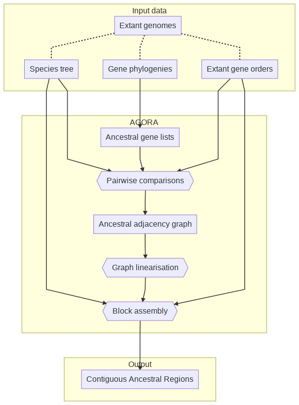
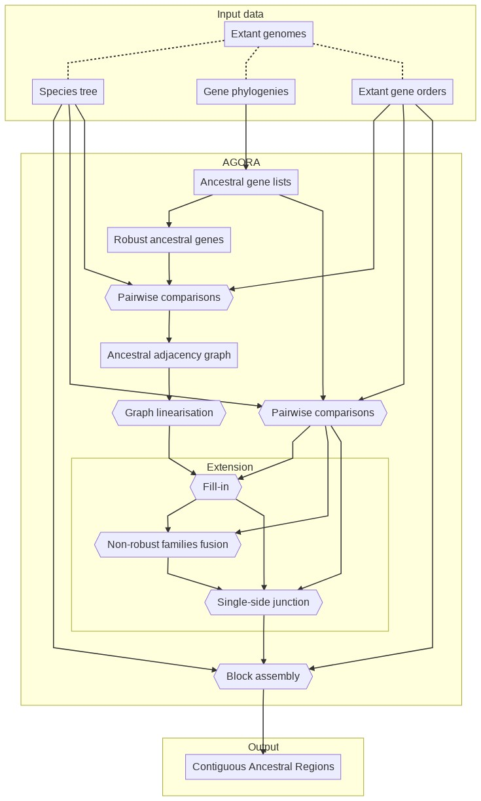

# AGORA How To

Written by Alexandra LOUIS (alouis {at} biologie {dot} ens {dot} fr),
Matthieu MUFFATO (muffato {at} ebi {dot} ac {dot} uk), and
Hugues ROEST CROLLIUS (hrc {at} ens {dot} fr).  
DYOGEN Laboratory, Institut de Biologie de l'École Normale Supérieure
(IBENS)  
46 rue d'Ulm, 75005 Paris

**Table of contents:**

* [History](#history)
* [What AGORA does and does not do](#what-agora-does-and-does-not-do)
* [Input file formats](#input-file-formats)
* [Running AGORA](#running-agora)
  * [Extraction of ancestral gene content](#extraction-of-ancestral-gene-content)
  * [AGORA with no selection of robust families](#agora-with-no-selection-of-robust-families)
  * [AGORA with selection of robust families](#agora-with-selection-of-robust-families)
* [Output format and post-processing scripts](#output-format-and-post-processing-scripts)

----

## History

AGORA stands for "Algorithm for Gene Order Reconstruction in Ancestors"
and was developed by Matthieu Muffato during his PhD (2007-2010) in the
DYOGEN Laboratory at the École normale supérieure in Paris. Since then
it has been constantly used in the group, especially to generate
ancestral genomes for the [Genomicus](https://www.genomicus.biologie.ens.fr/genomicus)
online server for comparative genomics. Many algorithms used
in AGORA are described in details in Matthieu's thesis, available only
in French [(Muffato 2010)](https://www.biblio.univ-evry.fr/theses/2010/2010EVRY0040.pdf)
and the core algorithm used to build and linearise the adjacency graph is
described in a separate study [(Berthelot et al 2015)](https://www.cell.com/cell-reports/pdfExtended/S2211-1247\(15\)00204-1).

## What AGORA does and does not do

AGORA takes as input a set of extant gene lists, ordered by chromosome
(or scaffolds), a species tree linking the genomes, and phylogenetic
gene trees reconciled with the species tree. It will produce linear
ancestral gene orders (with transcriptional orientation) at all the
nodes of the species tree. This may result in very long successive
ancestral adjacencies or CARs (Contiguous Ancestral Regions) if the data
allows it (e.g. closely related extant genomes with contiguous sequence
assemblies) or very short ones if the data does not allow it (e.g. extant
genes distributed in short scaffolds, or very rearranged extant
genomes).

AGORA does not:

* Reconstruct ancestral nucleotide or protein sequences.
* Reconstruct circular chromosomes (*)

(*) The only exception is the mitochondrial genome, which has a canonical
way of being represented in a linear fashion.

AGORA can be run in two modes. The first and simplest uses all possible
adjacencies found in extant genomes to reconstruct ancestral
adjacencies, eventually leading to contiguous ancestral regions. In
principle this should work fine if the genomes are perfectly sequenced
and annotated, but they rarely are. Also, gene duplications are
difficult to resolve accurately in gene phylogenies, and AGORA is
sensitive to errors in gene trees. A second, more complex version first
identifies "robust" gene familes, on the basis of a user-defined
criterion. Typically this can be a requirement that there are as many
genes on a tree as there are species, thus limiting the chances that
duplications have occurred. AGORA will first build a temporary ancestral
genome with these genes (ignoring all other families) as a robust
backbone. Then, it will use remaining gene families to fill in the space
between robust genes, but without breaking a chain of robust genes.

In this HowTo, all the paths are relative to the root of the repository.

## Input file formats

To reconstruct ancestral gene orders, AGORA needs 3 kinds of files (see
[`example/data/`](../example/data)):

* A species tree, e.g. [`example/data/Species.conf`](../example/data/Species.conf)
* A set of extant gene trees reconciled with the species tree, e.g.
  [`example/data/GeneTreeForest.phylTree.bz2`](../example/data/GeneTreeForest.phylTree.bz2).
  Extant genes that are not in a tree will not be used for gene order reconstruction.
* The order of extant genes in each extant genomes, e.g.
  [`example/data/genes/genes.M1.list.bz2`](../example/data/genes/genes.M1.list.bz2)

### Species tree

The species tree must be in _PhylTree_ format. The PhylTree format is a
human readable format of trees developed specifically for AGORA, based
on tabulations. See the example species tree:

* [`example/data/Species.conf`](../example/data/Species.conf) -- PhylTree format
* [`example/data/Species.nwk`](../example/data/Species.nwk) -- Newick format
* [`example/data/Species.pdf`](../example/data/Species.pdf) -- Graphical representation

To convert a tree from NHX format to PhylTree format, use the script
`newickSpeciesTree2phylTreeSpeciesTree.py`:

```bash
src/preprocessing/newickSpeciesTree2phylTreeSpeciesTree.py Species.nwk > Species.conf
```

:warning: **Warning**: Internal labels (e.g. "Amniota" or "Anc659123") have to be unique !

### The forest of gene trees

The forest of gene trees has to be in PhylTree format as well, in a
single file. See an example family:

* [`example/data/Family1.phylTree`](../example/data/Family1.phylTree) -- PhylTree format
* [`example/data/Family1.nhx`](../example/data/Family1.nhx) -- Newick format
* [`example/data/Family1.pdf`](../example/data/Family1.pdf) -- Graphical representation

To convert trees from NHX format to PhylTree format, use the script
`nhxGeneTrees2phylTreeGeneTrees.py`:

```bash
src/preprocessing/nhxGeneTrees2phylTreeGeneTrees.py Family1.nhx > Family1.phylTree
```

The forest file is merely the concatenation of all the families. See the example forest:

* [`example/data/GeneTreeForest.phylTree.bz2`](../example/data/GeneTreeForest.phylTree.bz2) -- PhylTree format
* [`example/data/GeneTreeForest.nhx.bz2`](../example/data/GeneTreeForest.nhx.bz2) -- Newick format

### The genes files

The genes files used by AGORA contain the list of genes on each extant
genome. The format is tab-separated values, in 5 mandatory columns (the
6^th is optional). One file must be provided per extant genome.

The fields are:

1. Name of the chromosome (text).
2. Start position of the gene (integer).
3. End position of the gene (integer).
4. Gene orientation (1 or -1)
5. Gene identifier (text)
6. Transcript identifier (text, optional)

:warning: **Warning**: The gene identifiers have to be consistent with the
ones used in the gene trees. The genes files must be named consistently
with the names of the species in the species tree, using the format `prefix.species_name.suffix`.

For example, if the species in the species tree are: `HUMAN`, `MOUSE`, `DOG`,
genes files have to be named:

* `prefix.HUMAN.suffix`, e.g. `genes.HUMAN.list`
* `prefix.MOUSE.suffix`
* `prefix.DOG.suffix`

If the species are `Homo.sapiens`, `Mus.musculus` and `Canis.familiaris`,
genes files have to be named:

* `prefix.Homo.sapiens.suffix`, e.g. `genes.Homo.sapiens.list`
* `prefix.Mus.musculus.suffix`
* `prefix.Canis.familiaris.suffix`

In [`example/data`](../example/data), the five species named in the [species-tree](../example/data/Species.conf)
are `M1`, `M2`, `M3`, `M4`,, and `M5`, and the genes files are named [`genes.M1.list.bz2`](../example/data/genes/genes.M1.list.bz2), etc.

## Running AGORA

> General AGORA workflow


The reconstruction itself can be perfomed with different approaches,
explained below, and the output is a set of CARs. The scripts
can be run individually, or through the wrapper `agora.py`
(with an appropriate `agora.ini` configuration file).

All AGORA scripts automatically creates the necessary output directories given to them
as command line arguments. This excludes standard output / error shell
redirections, which should still point at valid paths.

AGORA supports several compression formats for input and output files:

* gzip -- `.gz` extension
* bzip2 -- `.bz2` extension
* LZMA -- `.lzma` and `.xz` extensions

Compression / decompression costs extra CPU time, but decreases file transfer times
and storage footprint (typically 6x with bzip2).
Compression is also supported on the standard output by adding `+gz`, `+bz2`,
`+lzma`, or `+xz` on the command-line.

### Extraction of ancestral gene content

The first step in AGORA is to identify all ancestral genes for all
ancestral genomes, and print them in one file per target ancestral
genome.
The `ALL.extractGeneFamilies.py` script
takes as input the species tree, the forest of gene trees and a template
to name the output files.

```bash
mkdir -p example/results
src/ALL.extractGeneFamilies.py \
  example/data/Species.conf \
  example/data/GeneTreeForest.phylTree.bz2 \
  -OUT.ancGenesFiles=example/results/ancGenes/all/ancGenes.%s.list.bz2 \
  +bz2 \
  > example/results/GeneTreeForests.withAncGenes.phylTree.bz2 \
  2> example/results/log.ancGenes
```

Be careful to provide the correct path to write the _ancGenes_ files
(`ancGenes/all/ancGenes.%s.list.bz2`), it will be important if you use
AGORA on _robust_ family in a second step (see article). The `%s` will
be automatically replaced by the extant and ancestral species name, as
indicated in the species tree.

ancGenes files are tab-separated files, with the following two fields:

1. Ancestral gene names (generated by AGORA)
2. A space separated list of extant copies of this ancestral gene, in
the genome of extant species.

On the standard output, the script produces the forest of gene trees,
rewritten with the ancestral gene names at each node, in PhylTree format.
Note that the rest of the scripts will use these ancGenes files rather
than the forest of gene trees.

### AGORA with no selection of robust families

This is the simplest way of running AGORA. It will compare all extant
genomes pairwise to extract conserved adjacencies, generate the ancestral
adjacency graphs and linearise them to produce CARs.

> AGORA workflow with no selection of robust families



In this mode, the reconstruction is composed of three steps akin to a
genome assembly:

* The pairwise comparisons provide "reads" of the ancestral genomes
* The reads are assembled into contigs ("Ancestral gene order" step)
* The contigs are assembled into scaffolds ("Block assembly" step)

The ancestral gene lists have been generated in the
[previous section](#extraction-of-ancestral-gene-content).
The scripts can be run step by step or through the wrapper `agora.py`
(with an appropriate `agora.ini` configuration file).
In the following command lines, `A0` represents the name of the target
ancestor for the reconstructions (which must exist in the species tree).
This ancestor and all its descendants will be reconstructed.

#### Step by step

##### Pairwise comparisons

This step will compare extant genomes in all possible pairwise
combinations to identify conserved adjacencies.

```bash
mkdir -p example/results/diags/pairwise/pairs-all/
src/buildSynteny.pairwise-conservedPairs.py \
  example/data/Species.conf \
  A0 \
  -OUT.pairwise=example/results/diags/pairwise/pairs-all/%s.list.bz2 \
  -genesFiles=example/data/genes/genes.%s.list.bz2 \
  -ancGenesFiles=example/results/ancGenes/all/ancGenes.%s.list.bz2 \
  2> example/results/diags/pairwise/pairs-all/pairs.log
```

##### Ancestral gene order

This step will integrate all the pairwise comparisons identified above
for each ancestor and combine them into adjacency graphs, from which
CARs are derived.

```bash
mkdir -p example/results/diags/integr/denovo-all/
src/buildSynteny.integr-denovo.py \
  example/data/Species.conf \
  A0 \
  example/results/diags/pairwise/pairs-all/%s.list.bz2 \
  +searchLoops \
  -OUT.ancDiags=example/results/diags/integr/denovo-all/anc/diags.%s.list.bz2 \
  -LOG.ancGraph=example/results/diags/integr/denovo-all/anc/graph.%s.txt.bz2 \
  -ancGenesFiles=example/results/ancGenes/all/ancGenes.%s.list.bz2 \
  2> example/results/diags/integr/denovo-all/log
```

##### Block assembly

In this step, we basically reiterate the same process (pairwise comparisons
and integration into an adjacency graph) but on the CARs. The result is a set
of CARs made of CARs, that are much longer than in the previous steps.

:warning: **Warning**: The name of the ancestor has to be repeated !

```bash
mkdir -p example/results/diags/integr/denovo-all.groups/
src/buildSynteny.integr-groups.py \
  example/data/Species.conf \
  A0 \
  A0 \
  -IN.ancDiags=example/results/diags/integr/denovo-all/anc/diags.%s.list.bz2 \
  -OUT.ancDiags=example/results/diags/integr/denovo-all.groups/anc/diags.%s.list.bz2 \
  -LOG.ancGraph=example/results/diags/integr/denovo-all.groups/anc/graph.%s.txt.bz2 \
  -genesFiles=example/data/genes/genes.%s.list.bz2 \
  -ancGenesFiles=example/results/ancGenes/all/ancGenes.%s.list.bz2 \
  2> example/results/diags/integr/denovo-all.groups/log
```

#### All in one: agora.py

`agora.py` is a script that encapsulates the 3 previous scripts and runs
them automatically. The parameters, paths, etc, are defined in a configuration
file `agora.ini`. The example one contains documentation of all the options.

```bash
src/agora.py example/agora.ini -workingDir=results
```

All data will be created in the `workingDir` directory, which is relative
to the location of the configuration file. In this example, files are
created under `example/results`.

### AGORA with selection of robust families

This approach builds an adjacency graph using a subset of extant
conserved adjacencies, which are selected by a user-defined quality
criterion. The idea here is to build robust ancestral adjacency
scaffolds, and to insert within these adjacencies the remaining
ancestral genes.




Figure 2. Schematic of the AGORA pipeline with selection of robust
families. (A) Diagram with the name of the different AGORA procedures.
From the data (white boxes at the top), AGORA (grey rectangle) will
identify a subset of robust gene phylogenies according to a user-defined
criteria, then extract all ancestral genes (all genes and robust genes).
It will compare all extant genomes pairwise (considering all genes and
robust genes separately), build the adjacency graphs (de novo) and
linearise them to obtain robust contigs. It will then fill in the robust
contigs with non-robust genes (Fill-in), build contigs of non-robust
genes (weak families fusion) and insert these in the filled-in robust
contigs (Single side junction). Finally it will assemble the resulting
contigs (Bloc assembly) into Contiguous Ancestral Regions (CARs). (B)
The same diagram with the names of the scripts required for each
procedure, as described in this document.

#### Step by step

##### Selection of robust genes

```bash
src/ALL.filterGeneFamilies-size.py \
  example/data/Species.conf \
  A0 \
  1.0,0.9,0.77 \
  1.0,1.1,1.33 \
  -IN.ancGenesFiles=example/results/ancGenes/all/ancGenes.%s.list.bz2 \
  -OUT.ancGenesFiles=example/results/ancGenes/size-%s-%s/ancGenes.%s.list.bz2 \
  > example/results/ancGenes/size.txt.bz2 \
  2> example/results/ancGenes/size.log
```

##### Pairwise comparison

This step is run once for all ancestral genes, and once per set of
criteria for selecting robust families. Here, the example is given for
the criteria 1.0-1.0, meaning that robust families will have exactly the
same ratio between extant genes and extant species. A criteria of
0.9-1.1 will tolerate a 10% deviation from the previous ratio. In the
example, robust families are built once. But users may want to build
some ancestors with one condition (e.g. 1.0-1.0) and other ancestors
with another condition (e.g. 0.9-1.1). See for example the
`agora-size.ini` configuration file (section 2 and section 4) that is used
when running the wrap up script `agora.py`. This step should therefore be
run once for each set of desired criteria. AGORA will later pick what is
required from each run.

For all ancestral genes:

```bash
src/buildSynteny.pairwise-conservedPairs.py \
  example/data/Species.conf \
  A0 \
  -OUT.pairwise=example/results/diags/pairwise/pairs-all/%s.list.bz2 \
  -genesFiles=example/data/genes/genes.%s.list.bz2 \
  -ancGenesFiles=example/results/ancGenes/all/ancGenes.%s.list.bz2 \
  2> example/results/diags/pairwise/pairs-all/pairs.log
```

For robust gene families (once per set of criteria):

```bash
src/buildSynteny.pairwise-conservedPairs.py \
  example/data/Species.conf \
  A0 \
  -OUT.pairwise=example/results/diags/pairwise/pairs-size-1.0-1.0/%s.list.bz2 \
  -genesFiles=example/data/genes/genes.%s.list.bz2 \
  -ancGenesFiles=example/results/ancGenes/size-1.0-1.0/ancGenes.%s.list.bz2 \
  2> example/results/diags/pairwise/pairs-size-1.0-1.0/pairs.log
```

##### Adjacency graphs for robust gene families

```bash
src/buildSynteny.integr-denovo.py \
  example/data/Species.conf \
  A0 \
  example/results/diags/pairwise/pairs-size-1.0-1.0/%s.list.bz2 \
  -OUT.ancDiags=example/results/diags/integr/denovo-size-1.0-1.0/anc/diags.%s.list.bz2 \
  -LOG.ancGraph=example/results/diags/integr/denovo-size-1.0-1.0/anc/graph.%s.txt.bz2 \
  -ancGenesFiles=example/results/ancGenes/all/ancGenes.%s.list.bz2 \
  2> example/results/diags/integr/denovo-size-1.0-1.0/log
```

##### Copy previous ancestral scaffolds based on robust genes in one single directory

```bash
src/buildSynteny.integr-copy.py \
  example/data/Species.conf \
  A0 \
  -IN.ancDiags=example/results/diags/integr/denovo-size-1.0-1.0/anc/diags.%s.list.bz2 \
  -OUT.ancDiags=example/results/diags/integr/denovo-size-custom/anc/diags.%s.list.bz2 \
  2> example/results/diags/integr/denovo-size-custom/log
```

##### Refine

```bash
src/buildSynteny.integr-refine.py \
  example/data/Species.conf \
  A0 \
  example/results/diags/pairwise/pairs-all/%s.list.bz2 \
  -func=0,32\|100,40t\|10000 \
  -timeout=150 \
  -IN.ancDiags=example/results/diags/integr/denovo-size-custom/anc/diags.%s.list.bz2 \
  -OUT.ancDiags=example/results/diags/integr/denovo-size-custom.refine-all/anc/diags.%s.list.bz2 \
  -LOG.ancGraph=example/results/diags/integr/denovo-size-custom.refine-all/anc/graph.%s.txt.bz2 \
  2> example/results/diags/integr/denovo-size-custom.refine-all/log
```

##### Extend

```bash
src/buildSynteny.integr-extend.py \
  example/data/Species.conf \
  A0 \
  example/results/diags/pairwise/pairs-all/%s.list.bz2 \
  +onlySingletons \
  -IN.ancDiags=example/results/diags/integr/denovo-size-custom.refine-all/anc/diags.%s.list.bz2 \
  -OUT.ancDiags=example/results/diags/integr/denovo-size-custom.refine-all.extend-all/anc/diags.%s.list.bz2 \
  -LOG.ancGraph=example/results/diags/integr/denovo-size-custom.refine-all.extend-all/anc/graph.%s.txt.bz2 \
  2> example/results/diags/integr/denovo-size-custom.refine-all.extend-all/log
```

##### Half-insert

```bash
src/buildSynteny.integr-halfinsert.py \
  example/data/Species.conf \
  A0 \
  example/results/diags/pairwise/pairs-all/%s.list.bz2 \
  -IN.ancDiags=example/results/diags/integr/denovo-size-custom.refine-all.extend-all/anc/diags.%s.list.bz2 \
  -REF.ancDiags=example/results/diags/integr/denovo-size-custom.refine-all/anc/diags.%s.list.bz2 \
  -OUT.ancDiags=example/results/diags/integr/denovo-size-custom.refine-all.extend-all.halfinsert-all/anc/diags.%s.list.bz2 \
  -LOG.ancGraph=example/results/diags/integr/denovo-size-custom.refine-all.extend-all.halfinsert-all/anc/graph.%s.txt.bz2 \
  2> example/results/diags/integr/denovo-size-custom.refine-all.extend-all.halfinsert-all/log
```

##### Scaffolding

```bash
src/buildSynteny.integr-groups.py \
  example/data/Species.conf \
  A0 \
  A0 \
  -IN.ancDiags=example/results/diags/integr/denovo-size-custom.refine-all.extend-all.halfinsert-all/anc/diags.%s.list.bz2 \
  -OUT.ancDiags=example/results/diags/integr/denovo-size-custom.refine-all.extend-all.halfinsert-all.groups/anc/diags.%s.list.bz2 \
  -LOG.ancGraph=example/results/diags/integr/denovo-size-custom.refine-all.extend-all.halfinsert-all.groups/anc/graph.%s.txt.bz2 \
  -genesFiles=example/data/genes/genes.%s.list.bz2 \
  -ancGenesFiles=example/results/ancGenes/all/ancGenes.%s.list.bz2 \
  2> example/results/diags/integr/denovo-size-custom.refine-all.extend-all.halfinsert-all.groups/log
```

##### Copy of the results in the final repository

```bash
src/buildSynteny.integr-copy.py \
  example/data/Species.conf \
  A0 \
  -IN.ancDiags=example/results/diags/integr/denovo-size-custom.refine-all.extend-all.halfinsert-all.groups/anc/diags.%s.list.bz2 \
  -OUT.ancDiags=example/results/diags/integr/final/anc/diags.%s.list.bz2 \
  2> example/results/diags/integr/final/log
```

#### All in one: agora.py

This script will run all the above steps automatically. Use the
`agora-size.ini` configuration file to set paths to scripts and to set
parameters.

Run:

```bash
src/agora.py \
  conf/agora-size.ini \
  -workingDir=example/results/ \
  > agora-size.log
```

## Output format and post-processing scripts

* The diags files

```
example/results/diags/integr/final/anc/diags.\*.list.bz2
```

This directory contains a file for each ancestral reconstructed genome
(e.g. `diags.A0.list.bz2`). There are five tab-separated fields, and values
in each field are further separated by single spaces. The term 'diag'
historically refers to the diagonal lines that appear in 2 dimensional
matrices comparing 2 genomes and reflecting successive conserved
adjacencies.

The fields are:

1. Name of the ancestral species.
2. Number of genes in the ancestral block.
3. List of gene IDs. Each ID corresponds to the line number in the
   corresponding ancGenes.Species.list (starting from 0).
4. Gene transcriptional orientation (strand) within the block.
5. A relative confidence index for each inter-block linkage. The values
   in parenthesis are the size of the initial blocks.

The values without parenthesis represent the number of time the two
adjacent blocks are adjacent in extant species.

The sum of the lengths of the initial blocks (numbers in parenthesis) is
thus equal to the size of the whole block (field number 2)

ex: A block of 8 genes in A0 made of 2 sub-blocks linked by an adjacency
of score 6.

```
A0	8	4559 4179 10099 15638 1304 10998 5675 13765	-1 -1 -1 1 1 -1 -1 1	(5) 6 (3)
```

* Post processing scripts: transforming diags files to genome files

```bash
src/postprocessing/misc.convertContigsToGenome.py \
  example/results/diags/integr/final/anc/diags.A0.list.bz2 \
  tmp/ancGenes/all/ancGenes.A0.list.bz2 \
  > tmp/ancGenomes/ancGenome.A0.list
```

As an example:

```
tmp/ancGenomes/ancGenomes.\*.list
```

This directory contains a file for each ancestral reconstructed genome
(e.g. `ancGenome.A0.list`).

There are five tab-separated fields, and values in each field are
further separated by single spaces.

The fields are:

1. Name of the ancestral block.
2. Relative start position of the ancestral gene.
3. Relative end position of the ancestral gene.
4. Ancestral gene orientation within the block.
5. Ancestral gene names. The first name corresponds to the ancestral
   gene, subsequent ones are the list of extant copies of this ancestral
   gene, in the genome of extant species.
